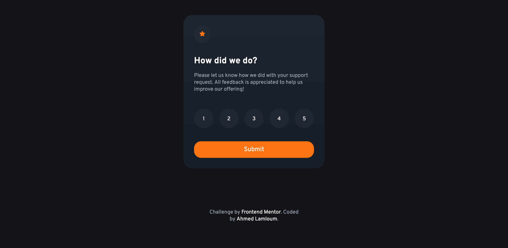

# Frontend Mentor - Interactive rating component solution

This is a solution to the [Interactive rating component challenge on Frontend Mentor](https://www.frontendmentor.io/challenges/interactive-rating-component-koxpeBUmI). Frontend Mentor challenges help you improve your coding skills by building realistic projects. 

## Table of contents

- [Overview](#overview)
  - [The challenge](#the-challenge)
  - [Screenshot](#screenshot)
- [My process](#my-process)
  - [Built with](#built-with)
  - [What I learned](#what-i-learned)
- [Author](#author)


## Overview

### The challenge

Users should be able to:

- View the optimal layout for the app depending on their device's screen size
- See hover states for all interactive elements on the page
- Select and submit a number rating
- See the "Thank you" card state after submitting a rating

### Screenshot



### Links

- Solution URL: [solution URL here](https://your-solution-url.com)
- Live Site URL: [live site URL here](https://your-live-site-url.com)

## My process

### Built with

- Semantic HTML5 markup
- CSS custom properties
- Flexbox
- CSS Grid
- JavaScript

### What I learned

change group of elements display using el.style.display ... 

To see how you can add code snippets, see below:


```js
btn.onclick = () => {
  element.style.display = "none";
  element2.style.display = "Whatever-you-want"
}
```

### Continued development

I realy wanted to add transition animation but I will figure how to do this 😎


## Author

- Website - [Ahmed Lamloum](https://a-lamloum.github.io/react-portfolio/)
- Frontend Mentor - [@a-lamloum](https://www.frontendmentor.io/profile/a-lamloum)
- Twitter - [@Ahmadom65222484](https://www.twitter.com/Ahmadom65222484)

